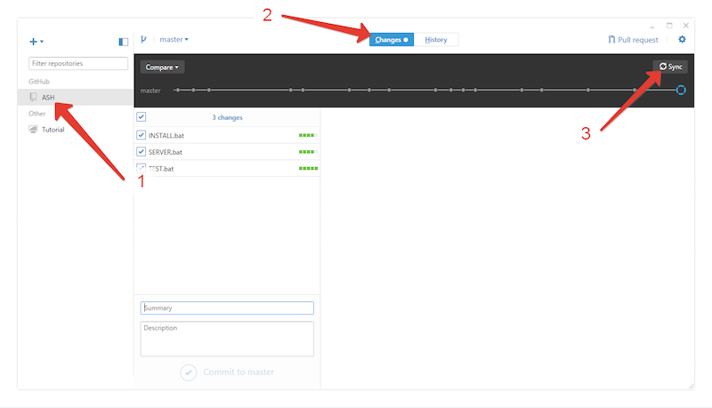

# HowTo


## [Оглавление](id:summary)


1. [Подготовка](#1-Подготовка)
2. [Внесение изменений в проект](#2-Внесение-изменений-в-проект)
	1. [Добавление нового инструмента или редактирование существующего](#21-Добавление-нового-инструмента-или-редактирование-существующего)
	2. [Добавление новой модели](#22-Добавление-новой-модели)
	3. [Добавление переводов](#23-Добавление-переводов)
	4. [Запуск тестов](#24-Запуск-тестов)
	5. [Запуск локального сервера](#25-Запуск-локального-сервера)
	6. [Загрузка на сервер](#26-Загрузка-на-сервер)
3. [Генерация паспортов](#3-Генерация-паспортов)

## 1. [Подготовка](id:preparation)

*Данные действия нужно будет выполнить всего 1 раз!*

1. Перейти на [www.github.com](http://www.github.com). Это хранилищше как кода системы для генерации сайта, так и непосредственно хостинг.
2. Зарегистрироваться в этом сервисе.
	
3. Сообщить мне о регистрации и дождаться пока я дам доступ к коду.
4. Перейти на [desktop.github.com](https://desktop.github.com), скачать и установить программу.
	
5. Перейти на [nodejs.org/en/download/](https://nodejs.org/en/download/), загрузить установщик для Windows, установить.
	
6. Перейти на [www.sublimetext.com/3](http://www.sublimetext.com/3), загрузить установщик для Windows, установить.
	
7. Запустить установленное приложение `Github`. Ввести почту и пароль, которые мы указали при регистрации в п.2
	
8. Нажимать `Continue` до тех пор, пока приложение не перейдейдет на вкладку `Repositories`.  Выбрать репозиторий `VladimirSemenyuk/ASH`. Появится окно быора папки, в которую потом скопируется код сайта. Выбрать папку, и **запомнить ее расположение**. Копирование кода займет какое-то время.
9. После завершения копирования кода перейти в папку и запустить файл `INSTALL.bat`. Затем нужно дождаться пока черное окошко не закроется.


## 2. [Внесение изменений в проект](id:updating)
---

Для описания объектов используется формат JSON.

Основные концепции формата:

1. Формат предназначен для описание физических сущностей в труктурированной форме. 
2. Формат оперирует несколькими типами данных
	* Число (описывается просто числом, введенным с клавиатуры)
	
	```
	1
	3.14
	-10000
	```
	* Строка (любые символы, заключенные между кавычками)
	
	```
	"Это строка, как и 2 примера ниже."
	"123124335"
	"gjdflgjlkdfjglkdfjg"
	```
	
	* Объект (начинается символои `{`, заканчивается символом `}`. Содержит в себе "поля". Поле имеет заголовок (всегда строка) и значение (любой тип). Значение и и заголовок отделяются `:`, после значения всегда ставится `,` , кроме последней пары заголовок-значение).
	
	```
	{
		"name": "Иван",
		"surname": "Петров",
		"age": 32,
		"appearence": {
			"head": "маленькая",
			"body": "большое"
		}
		"job": "сантехник"
	}
	```	
	Обрати внимание на то, что значением поля `appearence` является другой объект, т.е. один объект сложен в другой. А также на отсутствие запятой после `"job": "сантехник"` и `"body": "большое"`, т.к. они являются последними полями в своем объекте.
	
	* Массив (начинается символои `{`, заканчивается символом `}`. Содержит в себе перечисленнные через запятую данные любых типов).
	
	```
	[123, 3.14, "это строка в массиве, содержащем 3 числа и строку", -1000]
	
	[
		123,
		{
			"name": "Иван",
			"surname": "Петров"
		},
		"это строка в массиве, содержащем число, объект и строку"
	]
	```

### 2.1 [Добавление нового инструмента или редактирование существующего](id:new-instrument)

1. Запустить приложение `Sublime Text`.
2. Нажать `File`->`Open`и выбрать папку, куда был скопирован код.
3. В приложении в левой части появится дерево папок проекта.
4. Раскрываем папку `data`, затем папку `instruments` и добавляем новую папку (щелчком правой кнопки мыши на той папке, где нужна новая), название которой совпадает с серийным номером инструмента. Если нужно отредактировать существующий, то создавать новую не надо, нужно открыть существующую.
5. Выбрать или создать в папке инструмента файл `specs.json`.
6. Скопировать ее в этот файл код:

	```
{
  	"id": 151108,
  	"model": "faberge",
  	"submodel": "",
  	"type": "guitar",
  	"video": "",
  	"images": {
    	"list": "list.jpg",
    	"list2x": "list.2x.jpg",
    	"preview": "",
    	"preview2x": "",
    	"gallery": [
      		"g1.jpg",
      		"g2.jpg"
    	]
  	},
  	"specs": {
    	"scaleLength": "24.75\"",
	    "fretsCount": "22",
    	"stringsCount": "6",
	    "fingerboardRadius": "12\"",
    	"bodyWood": "Alder",
	    "topWood": "Buckeye Burl",
    	"neckWood": "Maple",
	    "fingerboardWood": "Rosewood",
    	"construction": "Set",
	    "dots": "",
    	"nut": "Bone",
    	"hardwareColor": "Gold",
    	"tuners": "Gotoh 510",
	    "bridge": "Schaller",
    	"pickups": ["Lollar"],
    	"electronics": "Volume/Tone/Balance",
    	"switching": ["Hamb/Coils"],
    	"color": "",
    	"finish": "Transparent High Gloss &mdash; Handpolished"
	}
}
	```
	
	

7. Далее просто достаточно отредактировать требуемые поля. Каждое поле кроме `id`, `images` и `specs`, является строкой. `id` - число, `images` и `specs` - объекты.
	* `id` - должно совпадать с именем папки.
	* `model` - должно совпадать с существующими `id` моделей. Модели описаны в файле `data/models.json`. Можно открыть его и посмотреть какие `id` там существуют.
	* `images` содержит поля:
		* `list` и `list2x`, значения которых равны названиям картинок, которые отображаются на списке инструментов; **[см. п.8](#2-1-8)**
		* `preview` и `preview2x`, значения которых равны названиям картинок, которые отображаются главными в карточке инструмента; *(эти поля можно оставить пустыми, если не галавная картинка не нужна)* **[см. п.8](#2-1-8)**
		* `gallery`, значением которого является массив строк, значения которых совпадают с названиями картинок, которые отображаются в квадратах сбоку от спецификации. **[см. п.9](#2-1-9)**
8. [В папке psd](id:2-1-8) нужно открыть в `Photoshop` файл, неазвание которого совпадает с мензурой инструмента и разместить в нем отдельным слоем "обтравленной изображение". При этом верхний попрожек и нижнее крепление для ремня должны совпасть с таковыми на уже имеющимся в файле инструменте. Затем нужно скрыть все слои, кроме нового инструмента, и экспортировать в следующие файлы внутрь папки с файлом `specs.json`:
	* `list.2x.jpg` - выставить высоту экспортируемого файла в `380px`, ширина рассчитается автоматически. **Обязательно сделай это изображение!** После экспорта открой этот в редакторе и поверти его, чтобы инструмент стоял вертикально.
	* `list.jpg` - выставить высоту экспортируемого файла в `190px`, ширина рассчитается автоматически. **Обязательно сделай это изображение!** После экспорта открой этот в редакторе и поверти его, чтобы инструмент стоял вертикально.
	* `preview.2x.jpg` - выставить высоту экспортируемого файла в `2400px`, ширина рассчитается автоматически. *Этот файл является необязательным.*
	* `preview.jpg` - выставить высоту экспортируемого файла в `1200px`, ширина рассчитается автоматически. *Этот файл является необязательным.*
9. В папку инструмента нужно скопировать все картинки, которые будут отображать в квадратах и переименовать их, добавив им в начало букву `g` . **Это очень важно!** Имена именно этих файлов записываются в `specs.json` в массиве `gallery` в поле `images`.
10. Добавь переводы, если их нет. **[см. раздел 2.3](#23-Добавление-переводов)**
11. Запусти тесты. **[см. раздел 2.4](#24-Запуск-тестов)**
12. Запусти локальный сервер для ручной проверки. **[см. раздел 2.5](#25-Запуск-локального-сервера)**
13. Загрузи все на сервер. **[см. раздел 2.6](#26-Загрузка-на-сервер)**

### 2.2 [Добавление новой модели](id:new-model)

1. Придумать id `модели` на **английском языке**.
2. Добавить инструмент этой модели, указав в его поле `model` придуманный `id`. **[см. раздел 2.1](#21-Добавление-нового-инструмента-или-редактирование-существующего)**
2. Oткрыть файл `models.json` из папки `data`. В этом файле лежит массив всех моделей. Скопируй в конец файла следующий код и отредактируй его, заменив значение поля `sampleInstrument` на `id` нового инструмента, проставив `type` как `guitar`  или `bass`, `name` - название модели на английском.

	```
{
    "id": "faberge",
    "name": "Faberge",
    "type": "guitar",
    "description": "",
    "sampleInstrument": 150302
}
	```
3. Не забудь проверить, что в этом массиве все объекты отделены запятыми.
4. Добавь переводы, если их нет. **[см. раздел 2.3](#23-Добавление-переводов)**
5. Запусти тесты. **[см. раздел 2.4](#24-Запуск-тестов)**
6. Запусти локальный сервер для ручной проверки. **[см. раздел 2.5](#25-Запуск-локального-сервера)**
7. Загрузи все на сервер. **[см. раздел 2.6](#26-Загрузка-на-сервер)**

### 2.3 [Добавление переводов](id:translations)

Если ты добавил новые тексты, то нужно добавить переводы.

Для это сделай:

1. Открой из папки `service` файл `dicts.json`. Он представляет собой объект, имена полей которого - тексты на английском, а значения - тектсы на русском.
2. Добавь новый текст и перевод для него. **Точное совпадения текста в файле `dicts.json` и других файлах очень важно. Расхождение теста даже в пробел приведет к тому, что он не будет переводиться!** 
3. Проверь правильность расставления запятых между полями.

### 2.4 [Запуск тестов](id:tests)
ы
Тесты могут выявить основные ошибки в тових изменениях и написать тетбе о них.

1. Запусти файл `TEST.bat`.
2. Если тесты прошли, то ты увидишь короткое зеленое сообщение. Иначе будет список ошибок. 
3. Если что-то не понятно, то пиши мне. Я помогу разобраться.

### 2.5 [Запуск локального сервера](id:server)

1. Запусти файл `SERVER.bat`.
2. Подожди немного, пока не увидишь строку `Started connect web server on http://localhost:7000`. **Внимание! Сервер запуститься только если тесты прошли упешно. [см. раздел 2.4](#24-Запуск-тестов)**
3. Перейди в браузере на [http://localhost:7000](http://localhost:7000)
4. Убедись что все работает, все изменения выглядят так, как ты ожидаешь. Затем закрой черное окно.

### 2.6 [Загрузка на сервер](id:upload)

1. Открой приложение `Github`. Выбери слева раздел `ASH`, сверху раздел `Changes`, нажми справа вверху кнопку `Sync`.
	

2. В середине окна будет список файлов, которые ты редактировал. При клике на них ты увидишь список изменений в каждом файле.
3. В поле `Summary` внизу окна введи текст, который описывает то, что ты изменил. Например: "Добавил новый инструмент XXXXXX". И нажми кнопку `Commit to master` под полем.

	
4. После этого твои изменения появятся в списке изменений в самом верху. Убедись что они есть и нажми справа вверху кнопку `Sync`. Она поменяет свее название на `Syncing`.

	 
5. Дождись пока закончится синхронизация (кнопка снова будет называться `Sync`).
6. **Через 1 минуту** перейди в браузере на [www.travis-ci.org/VladimirSemenyuk/ASH](https://travis-ci.org/VladimirSemenyuk/ASH) Этот система автоматической сборки и оптимизации сайта. Ты увидишь посередине окна **желтую** плашку. *На ней будет отображаться текст, который вводил в пункте 3.*
	 

7. Через 4 минуты желтая плашкка превратиться в **зеленую**, если все хорошо. Или в **красную**, если сборка не удалась. В случае "красной" сборки просто напиши мне.
8. Если сборка зеленая, то **в течении 10 минут** код окажется на сайте, т.е. сайт обновится.

## 3 [Генерация паспортов](id:sheets)

1. Запусти файл `PRINT.bat`.
2. Когда черное окно закроется, то появится папка `print`, в которой будут лежать паспорта для инструментов.

